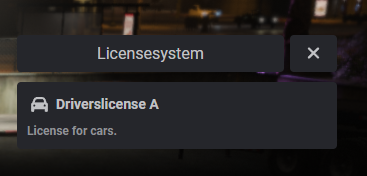
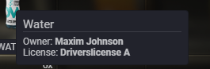

<h2>BYTE-SCRIPTS</h2>

### Description
Licenses as items using metadata. Performance: 0.00ms and up to 0.01ms (while in use)

### Preview

### Setup
You can just start the script. Changes can be made in the [Settings](data/settings.lua) file.
If you want to use logging check the [Webhook](modules/logger/server.lua) file.

### Dependencies
- oxmysql
- ox_lib
- es_extended (Legacy)

### Links
- Tebex: https://bytescripts.tebex.io/
- Discord: https://discord.gg/6XwewsSk9W